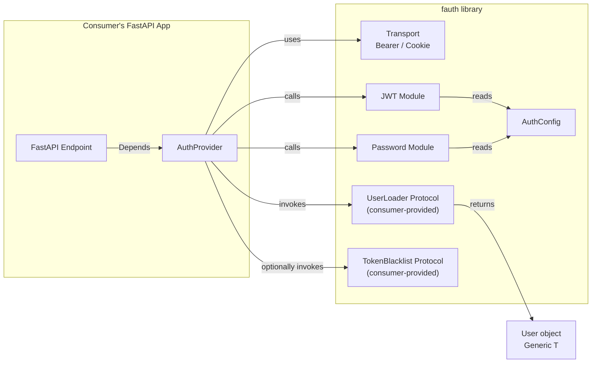

# FAuth — Ergonomic Authentication Library for FastAPI

An ergonomic, plug-and-play authentication library for FastAPI that eliminates boilerplate around JWT, password hashing, user fetching, and RBAC by leveraging FastAPI's Dependency Injection, Pydantic, and Python Protocols.

## Open Design Decisions

> [!IMPORTANT]
> **Library name:** The plan uses `fauth` as the package name (matching the repo). Let me know if you'd prefer a different name or PyPI identifier.

> [!IMPORTANT]
> **Password hashing library:** The plan uses `pwdlib[argon2]` (modern, well-maintained). An alternative is `passlib[bcrypt]`. Please confirm which you prefer.

> [!IMPORTANT]
> **JWT library:** The plan uses `PyJWT` (lightweight, actively maintained). An alternative is `python-jose[cryptography]` (broader algorithm support). Please confirm.

> [!IMPORTANT]
> **Scope of v0.1:** The plan includes token revocation and pre-built routes as part of the initial build. If you'd prefer a leaner MVP (just config, JWT, password, provider, RBAC) and add those features later, let me know.

---

## Architecture Overview



---

## Proposed Changes

### Project Scaffolding

#### [NEW] pyproject.toml

Modern Python project configuration using `hatchling` as build backend.

- **Metadata:** name=`fauth`, version=`0.1.0`, requires-python `>=3.11`
- **Dependencies:** `fastapi>=0.100`, `pyjwt[crypto]>=2.8`, `pydantic>=2.0`, `pydantic-settings>=2.0`, `pwdlib[argon2]>=0.2`
- **Optional deps:** `[dev]` — `pytest`, `pytest-asyncio`, `pytest-cov`, `httpx`, `ruff`, `mypy`
- **Tools:** ruff config (line-length=120, select=standard rules), pytest config (asyncio_mode=auto), mypy config (strict)

#### [NEW] README.md

Library overview, quick-start usage example, feature list.

#### [NEW] .gitignore

Standard Python gitignore.

---

### Core Module — Configuration & Schemas

#### [NEW] src/fauth/\_\_init\_\_.py

Public API re-exports: `AuthConfig`, `AuthProvider`, `TokenPayload`, `UserLoader`, `TokenBlacklist`.

#### [NEW] src/fauth/config.py

```python
class AuthConfig(BaseSettings):
    secret_key: str
    algorithm: str = "HS256"
    access_token_expire_minutes: int = 15
    refresh_token_expire_minutes: int = 60 * 24 * 7  # 7 days
    token_type: Literal["bearer", "cookie"] = "bearer"
    cookie_name: str = "access_token"
    cookie_secure: bool = True
    cookie_httponly: bool = True
    cookie_samesite: Literal["lax", "strict", "none"] = "lax"
```

Centralized, env-variable friendly config. Users configure once, inject everywhere.

#### [NEW] src/fauth/schemas.py

| Model | Fields | Purpose |
|---|---|---|
| `TokenPayload` | `sub`, `exp`, `iat`, `jti`, `scopes`, `token_type`, `extra` | Decoded JWT payload |
| `TokenResponse` | `access_token`, `refresh_token`, `token_type` | Login response |

#### [NEW] src/fauth/exceptions.py

| Exception | Parent | When raised |
|---|---|---|
| `FAuthError` | `Exception` | Base for all library errors |
| `InvalidTokenError` | `FAuthError` | Token decode/validation failure |
| `TokenExpiredError` | `InvalidTokenError` | JWT `exp` has passed |
| `TokenRevokedError` | `InvalidTokenError` | JTI found in blacklist |
| `InsufficientPermissionsError` | `FAuthError` | RBAC check failed |
| `InvalidCredentialsError` | `FAuthError` | Password verification failed |

---

### Core Module — JWT & Password

#### [NEW] src/fauth/jwt.py

- `create_access_token(data: dict, config: AuthConfig) -> str` — Encodes JWT with `sub`, `exp`, `iat`, `jti` (uuid4), and optional `scopes`.
- `create_refresh_token(data: dict, config: AuthConfig) -> str` — Same as above with `token_type="refresh"` and longer expiry.
- `decode_token(token: str, config: AuthConfig) -> TokenPayload` — Decodes and validates; raises `InvalidTokenError` / `TokenExpiredError`.

#### [NEW] src/fauth/password.py

- `hash_password(plain: str) -> str` — Argon2 hash via `pwdlib`.
- `verify_password(plain: str, hashed: str) -> bool` — Constant-time comparison.

---

### Protocols & Types

#### [NEW] src/fauth/protocols.py

```python
from typing import Protocol, TypeVar, Optional

T = TypeVar("T")

class UserLoader(Protocol[T]):
    """Consumer implements this to look up a user from JWT payload."""
    async def __call__(self, token_payload: TokenPayload) -> Optional[T]: ...

class TokenBlacklist(Protocol):
    """Optional. Consumer implements to check/add revoked JTIs."""
    async def is_revoked(self, jti: str) -> bool: ...
    async def revoke(self, jti: str, expires_in: int) -> None: ...
```

This gives full inversion of control — the library never touches the database directly.

#### [NEW] src/fauth/types.py

Type aliases for `UserLoaderCallable`, `Scopes`, and generic helpers.

---

### Auth Provider (Main API Surface)

#### [NEW] src/fauth/provider.py

The central class that wires everything together:

```python
class AuthProvider(Generic[T]):
    def __init__(
        self,
        config: AuthConfig,
        user_loader: UserLoader[T],
        token_blacklist: TokenBlacklist | None = None,
    ): ...

    def get_current_user(self) -> T:
        """Returns a FastAPI Depends-compatible callable."""

    def get_current_active_user(self) -> T:
        """Same as above, but verifies user.is_active (duck-typed)."""

    def require_roles(self, *roles: str) -> T:
        """Returns a dependency that checks user.roles contains all required roles."""

    def require_permissions(self, *permissions: str) -> T:
        """Returns a dependency that checks user.permissions or JWT scopes."""

    async def login(self, username: str, password: str, ...) -> TokenResponse:
        """Authenticates user credentials, returns access + refresh tokens."""

    async def refresh(self, refresh_token: str) -> TokenResponse:
        """Validates refresh token, optionally rotates, returns new pair."""

    async def logout(self, token: str) -> None:
        """Revokes the token JTI via the blacklist callback."""
```

**Usage example** (from the consumer's perspective):

```python
from fauth import AuthConfig, AuthProvider

config = AuthConfig(secret_key="super-secret")

async def load_user(payload):
    return await db.get_user(id=payload.sub)

auth = AuthProvider(config=config, user_loader=load_user)

@app.get("/me")
async def me(user: User = Depends(auth.get_current_user())):
    return user

@app.get("/admin")
async def admin_panel(user: User = Depends(auth.require_roles("admin"))):
    return {"message": f"Welcome, {user.name}"}
```

---

### Transport Strategies

#### [NEW] src/fauth/transports/\_\_init\_\_.py
#### [NEW] src/fauth/transports/bearer.py

Wraps `OAuth2PasswordBearer` to extract token from `Authorization: Bearer <token>` header.

#### [NEW] src/fauth/transports/cookie.py

Extracts token from an HttpOnly cookie. Provides helpers to `set_cookie` / `delete_cookie` on responses.

The `AuthProvider` selects the transport based on `config.token_type`.

---

### Pre-Built Router (Optional)

#### [NEW] src/fauth/router.py

Optional convenience router users can mount:

```python
from fauth import AuthProvider

auth = AuthProvider(...)
app.include_router(auth.create_router(prefix="/auth"))
# Exposes: POST /auth/login, POST /auth/refresh, POST /auth/logout
```

---

### Testing Utilities (Consumer Test Helpers)

A dedicated `fauth.testing` sub-package that ships fake implementations of the library's protocols and a pre-wired `AuthProvider` factory, so consumers can write unit tests without real JWTs, password hashing, or database calls.

#### [NEW] src/fauth/testing/\_\_init\_\_\.py

Public re-exports: `FakeUserLoader`, `FakeTokenBlacklist`, `fake_auth_config`, `fake_auth_provider`.

#### [NEW] src/fauth/testing/config.py

```python
def fake_auth_config(**overrides) -> AuthConfig:
    """Returns an AuthConfig with safe test defaults (fixed secret, short expiry)."""
    defaults = {
        "secret_key": "test-secret-key-do-not-use-in-production",
        "algorithm": "HS256",
        "access_token_expire_minutes": 5,
        "refresh_token_expire_minutes": 10,
    }
    defaults.update(overrides)
    return AuthConfig(**defaults)
```

#### [NEW] src/fauth/testing/fakes.py

| Class | Implements | Behavior |
|---|---|---|
| `FakeUserLoader` | `UserLoader[T]` | In-memory `dict[str, T]` of users. Returns user matching `payload.sub`, or `None`. Pre-populate via `add_user()`. |
| `FakeTokenBlacklist` | `TokenBlacklist` | In-memory `set[str]` of revoked JTIs. `is_revoked()` checks the set; `revoke()` adds to it. |

```python
class FakeUserLoader(Generic[T]):
    """In-memory UserLoader for tests. Pre-populate with add_user()."""

    def __init__(self) -> None:
        self._users: dict[str, T] = {}

    def add_user(self, user_id: str, user: T) -> None:
        self._users[user_id] = user

    async def __call__(self, token_payload: TokenPayload) -> T | None:
        return self._users.get(token_payload.sub)


class FakeTokenBlacklist:
    """In-memory token blacklist for tests."""

    def __init__(self) -> None:
        self._revoked: set[str] = set()

    async def is_revoked(self, jti: str) -> bool:
        return jti in self._revoked

    async def revoke(self, jti: str, expires_in: int) -> None:
        self._revoked.add(jti)
```

#### [NEW] src/fauth/testing/provider.py

Convenience factory that wires fakes into a ready-to-use `AuthProvider`:

```python
def fake_auth_provider(
    users: dict[str, T] | None = None,
    with_blacklist: bool = False,
    config_overrides: dict | None = None,
) -> AuthProvider[T]:
    """Returns a fully-wired AuthProvider backed by in-memory fakes."""
    config = fake_auth_config(**(config_overrides or {}))
    loader = FakeUserLoader()
    if users:
        for uid, user in users.items():
            loader.add_user(uid, user)
    blacklist = FakeTokenBlacklist() if with_blacklist else None
    return AuthProvider(config=config, user_loader=loader, token_blacklist=blacklist)
```

**Consumer usage example:**

```python
# tests/conftest.py (in the consumer's project)
import pytest
from fauth.testing import fake_auth_provider
from myapp.models import User

@pytest.fixture
def auth():
    user = User(id="user-1", name="Alice", roles=["admin"], is_active=True)
    return fake_auth_provider(users={"user-1": user}, with_blacklist=True)
```

---

## Final Project Structure

```
fauth/
├── pyproject.toml
├── README.md
├── .gitignore
├── docs/
│   └── plan.md
├── src/
│   └── fauth/
│       ├── __init__.py          # Public API re-exports
│       ├── config.py            # AuthConfig (Pydantic Settings)
│       ├── schemas.py           # TokenPayload, TokenResponse
│       ├── exceptions.py        # Exception hierarchy
│       ├── jwt.py               # JWT create/decode
│       ├── password.py          # Argon2 hash/verify
│       ├── protocols.py         # UserLoader, TokenBlacklist Protocols
│       ├── types.py             # Type aliases
│       ├── provider.py          # AuthProvider (main API surface)
│       ├── router.py            # Optional pre-built routes
│       ├── testing/
│       │   ├── __init__.py      # Re-exports for test helpers
│       │   ├── config.py        # fake_auth_config() factory
│       │   ├── fakes.py         # FakeUserLoader, FakeTokenBlacklist
│       │   └── provider.py      # fake_auth_provider() factory
│       └── transports/
│           ├── __init__.py
│           ├── base.py          # Abstract transport
│           ├── bearer.py        # Bearer header transport
│           └── cookie.py        # Cookie transport
└── tests/
    ├── conftest.py              # Shared fixtures (AuthConfig, fake user loader)
    ├── test_config.py
    ├── test_jwt.py
    ├── test_password.py
    ├── test_provider.py
    ├── test_rbac.py
    ├── test_transports.py
    └── test_integration.py      # Full FastAPI app integration test
```

---

## Verification Plan

### Automated Tests

All tests run via **pytest**:

```bash
# From the fauth repo root
cd /home/matias/repositories/fauth

# Install in editable mode with dev deps
pip install -e ".[dev]"

# Run all tests with coverage
pytest tests/ -v --cov=fauth --cov-report=term-missing

# Run linting
ruff check src/ tests/

# Run type checking
mypy src/fauth/
```

| Test file | What it covers |
|---|---|
| `test_config.py` | `AuthConfig` defaults, env overrides, validation |
| `test_jwt.py` | Token encode/decode, expiry, invalid tokens, JTI uniqueness |
| `test_password.py` | Hash + verify round-trip, incorrect password rejection |
| `test_provider.py` | `get_current_user`, `get_current_active_user`, login flow |
| `test_rbac.py` | `require_roles`, `require_permissions`, insufficient perms raises 403 |
| `test_transports.py` | Bearer extraction, cookie set/read/delete |
| `test_testing.py` | `FakeUserLoader` add/lookup, `FakeTokenBlacklist` revoke/check, `fake_auth_config` defaults & overrides, `fake_auth_provider` wiring |
| `test_integration.py` | Full FastAPI `TestClient` end-to-end: register → login → access protected route → refresh → logout |

### Manual Verification

Since this is a library, the main manual check is to confirm the **developer experience** feels ergonomic:

1. After implementation, a small example FastAPI app in `examples/basic.py` will demonstrate all features.
2. The user can review the example to confirm the API surface is clean and intuitive.
